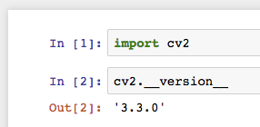

# python-opencv-notebook

Ready to run jupyter notebook in docker, with Python, OpenCV 3.3 and more.



### Setup

1. Install Docker CE - [for Mac](https://www.docker.com/docker-mac), [for Windows](https://www.docker.com/docker-windows) or [for Ubuntu](https://docs.docker.com/engine/installation/linux/ubuntu/)

2. Pull the image

    ```
    docker pull alexlouden/python-opencv-notebook
    ```

3. Run it from your project directory. The `data` directory will be created, shared with the docker container, and the jupyter notebook will be launched from here.

    ```
    docker run --interactive --init --name opencv-notebook --publish 8888:8888 --volume `pwd`/data:/app/data alexlouden/python-opencv-notebook
    ```

    Parameters:

    - `--interactive` - runs in foreground (will run in the background if you don't supply this)
    - `--init` - runs using [tini](https://github.com/krallin/tini) to reap zombies
    - `--name` - name the docker container
    - `--publish` - choose which ports to expose from the docker container to host
    - `--volume` - bind a volume, used to share data between container and host (must be an absolute path - I've used `pwd`)

    See [docker docs](https://docs.docker.com/engine/reference/commandline/run/) for more info.

4. You should see the following output:

    > Copy/paste this URL into your browser when you connect for the first time,
    to login with a token:
    >   http://localhost:8888/?token=<secrettoken>

    Open the URL in your browser, and you should get access!

5. Stop / start container

    ```
    docker stop opencv-notebook
    docker start -i opencv-notebook
    ```

### Notes

- Aims to be a lot simpler and easier to understand than https://github.com/jupyter/docker-stacks
- Uses the `python 3.6.3` base docker image
- Uses `pip` rather than `conda` (installs from `requirements.txt`)
- No virtualenv - uses the docker container's system Python
- Designed to run on your computer (not a public server) - no SSL, no password, runs as root docker user.

### Building from source

You can clone this repo and build the image yourself with:

```
git clone git@github.com:alexlouden/python-opencv-notebook.git
cd python-opencv-notebook
docker build -t python-opencv-notebook .
```
